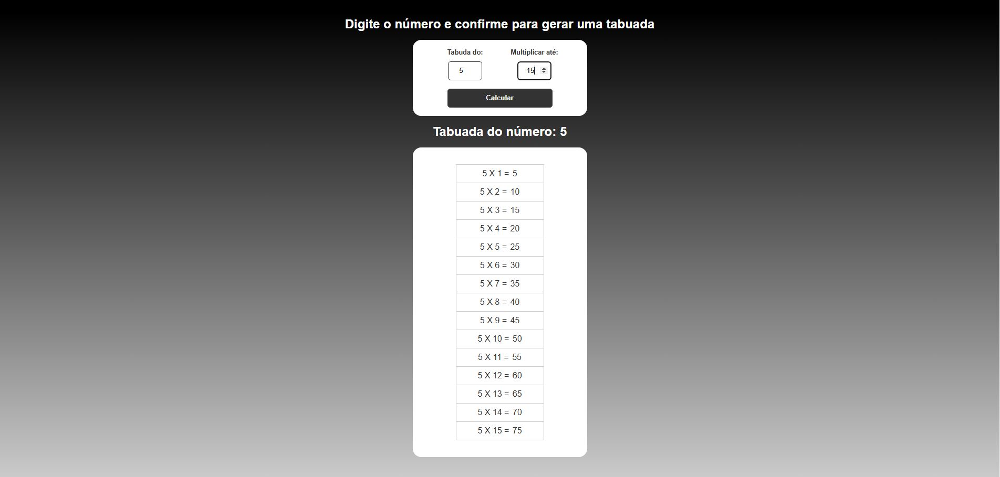

<h1 align="center">Tabuada</h1>

  <a href="#-tecnologias">Tecnologias</a>&nbsp;&nbsp;&nbsp;|&nbsp;&nbsp;&nbsp;
  <a href="#-projeto">Projeto</a>&nbsp;&nbsp;&nbsp;|&nbsp;&nbsp;&nbsp;
  <a href="#-protótipo">Protótipo</a>

 

  

## 🚀 Tecnologias

Esse projeto foi desenvolvido com as seguintes tecnologias:

- HTML e CSS
- Java Script
- Git e Github

## 💻 Projeto

Este site visa auxilixar as pessoas gerando tabuadas conforme as suas necessidades

## 🖥 Protótipo

Você pode visualizar o protótipo web através [DESSE LINK](https://thiagogreiner.github.io/Tabuada/)
